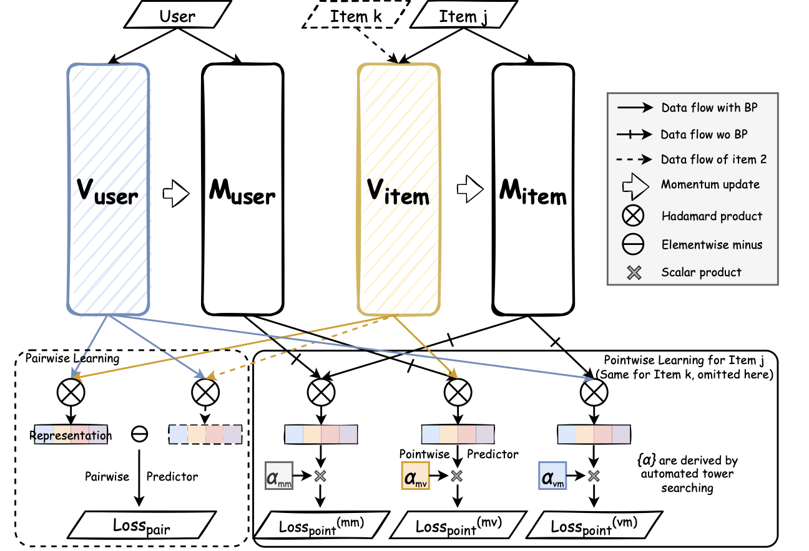

# Automated Stable Representation Learning with Implicit Feedback for Recommendation

Code repository of paper *'Automated Stable Representation Learning with Implicit Feedback for Recommendation'*

Jinming Yang, Menghan Wang, Yuchen Guo et al.



# Datasets

-  [Movielens-100k](https://github.com/Vadermit/ASL/tree/main/data/ml-100k)
- [Office Products](https://github.com/Vadermit/ASL/tree/main/data/office-products)
- [Movielens-1M](https://drive.google.com/file/d/1ycpFNoJt-fZ5CfyX_3MTsFpJhrDZP_Hy/view?usp=sharing)
- [Beauty](https://drive.google.com/file/d/17KDzaOB14FKiEKxJNzEIPcJrxazg5Pc0/view?usp=sharing)


# Quick Test

```bash
$ git clone https://github.com/Vadermit/ASL.git
$ cd ASL  
$ python main.py ml-100k
```

`ml-100k` can be replaced by `office-products`, `ml-1m` and `beauty`. Note that  [Movielens-1M](https://drive.google.com/file/d/1ycpFNoJt-fZ5CfyX_3MTsFpJhrDZP_Hy/view?usp=sharing) dataset and [Beauty](https://drive.google.com/file/d/17KDzaOB14FKiEKxJNzEIPcJrxazg5Pc0/view?usp=sharing) dataset need to be downloaded from the cloud drive to location './data/'.

